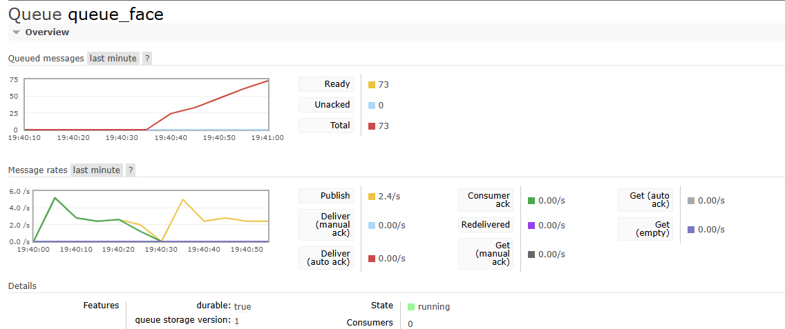
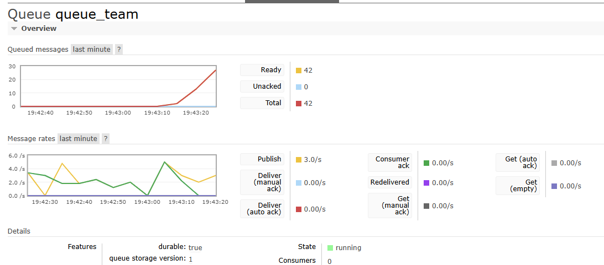

# Distributed Image Message System

## Overview

Este projeto demonstra um sistema distribuído simples usando RabbitMQ e Docker Compose. Consiste em:

* **Generator**: Gera e publica mensagens de imagens (faces ou brasões de times) em um Exchange do tipo Topic.
* **Consumer Face**: Consome mensagens de rostos, usando a routing key `face`.
* **Consumer Team**: Consome mensagens de brasões de times, usando a routing key `team`.
* **RabbitMQ**: Broker de mensagens que roteia as imagens de acordo com routing keys.

## Arquitetura

```text
+--------------+         +----------------+         +-------------+
|  Generator   | --(A)-> | RabbitMQ Topic | --(B)-> | Consumer     |
| (5 msgs/s)   |         |    Exchange    |         | (face /team) |
+--------------+         +----------------+         +-------------+
```

1. **Generator** publica nomes de arquivos de imagem (body) no Exchange `images` com routing key `face` ou `team`.
2. **RabbitMQ** usa o Exchange Topic para encaminhar mensagens às filas ligadas a cada routing key.
3. **Consumers** (`consumer_face`, `consumer_team`) consomem, imprimem e confirmam (ack) cada mensagem.

## Requisitos e Implementação

| Requisito                                                               | Onde está no código                                              |
| ----------------------------------------------------------------------- | ---------------------------------------------------------------- |
| Gerar mensagens rápidas (≥5 msgs/s)                                     | `PUBLISH_RATE = 5.0` em `message_generator.py`                   |
| Mensagens de dois tipos: `face` e `team`                                | Pastas `images/face` e `images/team`; `load_images()`            |
| Usar Topic Exchange para rotear por routing key                         | `ch.exchange_declare(exchange="images", exchange_type="topic")`  |
| Publicar messages com routing keys adequadas (`face`, `team`)           | `basic_publish(..., routing_key=key, body=fn)`                   |
| Consumer 1 (faces): consome da fila `queue_face` com `routing_key=face` | `queue_declare(queue="queue_face"); queue_bind(..., key="face")` |
| Consumer 2 (teams): consome da fila `queue_team` com `routing_key=team` | `queue_declare(queue="queue_team"); queue_bind(..., key="team")` |

## Pré-requisitos

* Docker e Docker Compose instalados
* Imagens de rostos em `images/face/`
* Imagens de brasões em `images/team/`

## Estrutura de Pastas

```
project-root/
├── docker-compose.yml
├── generator/
│   ├── Dockerfile
│   ├── requirements.txt
│   ├── message_generator.py
│   └── images/
│       ├── face/
│       └── team/
├── consumer_face/
│   ├── Dockerfile
│   ├── requirements.txt
│   └── consumer_face.py
├── consumer_team/
|   ├── Dockerfile
|   ├── requirements.txt
|   └── consumer_team.py
├── prints/
│   ├── face_queue.png      # Print do monitoramento da fila face
│   └── team_queue.png      # Print do monitoramento da fila team
└── README.md
```

## Como Executar

1. Clone o repositório:

   ```bash
   git clone <url-do-repo>
   cd trabalho06
   ```

2. Inicie com Docker Compose:

   ```bash
   docker-compose up --build
   ```

3. Logs:

   * **Generator**: publica nomes de arquivos (`✉ Published face → <nome>.png`)
   * **Consumer FACE**: imprime `📥 [FACE] <nome>`
   * **Consumer TEAM**: imprime `📥 [TEAM] <nome>`

4. Acesse o Management UI (opcional):

   * URL: `http://localhost:15672`
   * Usuário/Senha: `guest`/`guest`

5. Verifique as filas:

   * Navegue até a aba **Queues**.
   * Observe o crescimento (congestionamento) das filas `queue_face` e `queue_team`.

## Variáveis de Ambiente

* `RABBIT_HOST`: nome do host RabbitMQ (default: `rabbitmq`)
* `PUBLISH_RATE`: taxa de publicação (msgs/segundo; default: `5.0`)

## Monitoramento das Filas

A seguir, prints do congestionamento das filas obtidos via Management UI:

### Fila FACE


*Figura 1: Congestionamento da fila `queue_face` mostrando mensagens prontas e não confirmadas.*

### Fila TEAM


*Figura 2: Congestionamento da fila `queue_team` mostrando mensagens prontas e não confirmadas.*


## Considerações Finais

* O projeto atende aos requisitos de geração, publicação, roteamento e consumo de mensagens por tipo de imagem.
* Pode ser estendido para múltiplos consumidores ou processamentos adicionais (ex: análise de imagem).

---

*Desenvolvido para o Trabalho 06 de Sistemas Distribuídos*
